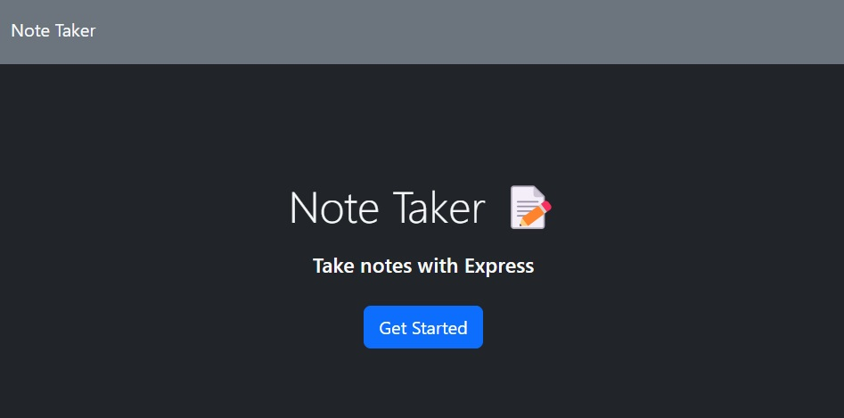
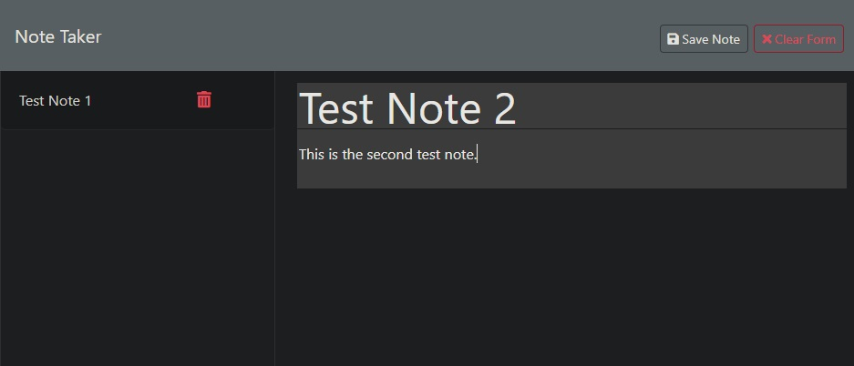

# Literate Journey

Live URL: https://literate-journey-a56f598a2635.herokuapp.com/

Repo URL: https://github.com/alexilson/literate-journey

## Description
Begin your Literate Journey today! This web app is designed to let you take notes and will save the notes to a database file, allowing you to visit the app later and recall all of your notes. It is even possible to delete your notes that you previously saved!

## Table of Contents
[Installation](#installation)

[Usage](#usage)

[License](#license)

[Contributing](#contributing)

[Tests](#tests)

[Questions](#questions)

## Installation
No installation required! It's a web app, just visit the URL!

## Usage
After loading the URL, click the Get Started button. Then, click in the Note Title area and enter the title of your note. Next, click on the Note Text area and enter the text for your note. Next, click the "Save Note" button in the top right side of your screen. You will see the note appear on the left side. Click the trash can icon on a note to delete it. Click the nt note itself  to have it load the note.

## License
MIT License

## Borrowed Code

server.js -> lines 96 through 103 were based on output from Xpert Learning Assistant.

/helpers/uuid.js -> Borrowed from Activity 18 and slightly modified.

## Questions
For additional questions, please contact me here:

GitHub: https://www.github.com/alexilson

Email: ilson.alex@gmail.com
